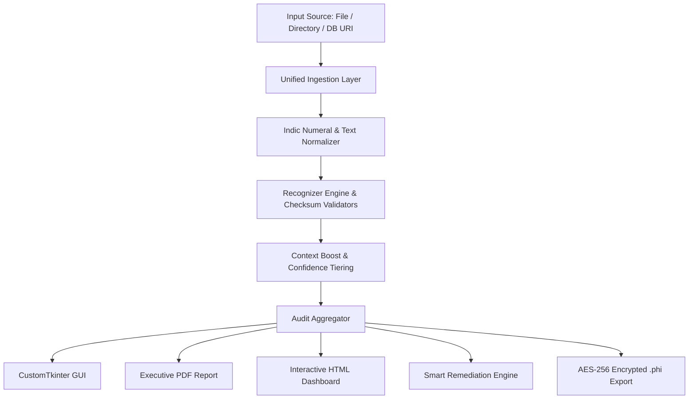

<div align="center">

# 🛡️ PHI & PII Compliance Scanner

### *Enterprise-Grade Local Data Discovery & Privacy Remediation Engine*

[](https://python.org)
[](https://meity.gov.in)
[](https://github.com)
[](https://pytest.org)

<p align="center">
  <b>Zero Cloud. Zero Telemetry. Verifiable by Inspection.</b><br>
  <i>Built for high-security enterprise environments, air-gapped infrastructure, and strict DPDP Act regulatory auditing.</i>
</p>

---

</div>

## 🌟 Visual Overview & User Interfaces

The scanner features dual interaction interfaces tailored for developers, data engineers, and enterprise security auditors:

### 1. 🎨 Native Desktop GUI (`scan --gui`)
Built using CustomTkinter with an executive slate design system:
* **Interactive Metric Cards**: Real-time high-risk exposure counter and compliance health badges.
* **Tabbed Workspace**: Dedicated workflows for file/folder scanning, database table ingestion, smart remediation, and report exporting.
* **Filterable Findings Table**: Dynamic search bar with instant entity classification filters.

### 2. ⚡ Command-Line Interface (`scan <path>`)
High-throughput CLI optimized for CI/CD pipelines, cron jobs, and bulk server scanning:
```bash
scan ./enterprise_data/ --output audit_report.pdf
```

---

## 💎 Core Capabilities

### 🔍 1. Precision Identifier Detection Engine
Employs cryptographic verification, structural checksums, and contextual surrounding token signals—eliminating false positives.

| Identifier | Verification Strategy | Confidence Tiers |
| :--- | :--- | :---: |
| **Aadhaar Number** | Verhoeff dihedral group checksum algorithm + sequential digit exclusion | <span style="color:#059669">**HIGH**</span> / <span style="color:#d97706">**MEDIUM**</span> |
| **PAN Number** | 4th char entity-holder verification (`P`, `C`, `H`, `F`, `A`, `T`, `B`, `L`, `J`, `G`) | <span style="color:#059669">**HIGH**</span> / <span style="color:#d97706">**MEDIUM**</span> |
| **GSTIN Identification** | State code prefix verification + Modulus 36 public checksum | <span style="color:#059669">**HIGH**</span> / <span style="color:#d97706">**MEDIUM**</span> / <span style="color:#64748b">**LOW**</span> |
| **Indian Mobile** | Telecom series 6–9 prefix validation + 10-digit boundaries | <span style="color:#d97706">**MEDIUM**</span> |
| **Bank Account** | Account length structure & branch ledger token validation | <span style="color:#059669">**HIGH**</span> / <span style="color:#d97706">**MEDIUM**</span> |
| **IFSC Code** | RBI 4-char bank prefix + 5th char zero + branch code matching | <span style="color:#059669">**HIGH**</span> / <span style="color:#d97706">**MEDIUM**</span> |
| **Voter ID (EPIC)** | 3-char alphanumeric state prefix + 7-digit identifier pattern | <span style="color:#059669">**HIGH**</span> / <span style="color:#d97706">**MEDIUM**</span> |
| **Passport Number** | Indian Passport letter prefix + 7-digit validation checks | <span style="color:#059669">**HIGH**</span> / <span style="color:#d97706">**MEDIUM**</span> |

---

### 📂 2. Broad Multi-Format & Read-Only Database Support
Scan structured spreadsheets, unstructured documents, logs, and live relational databases with zero memory footprint spikes:

```
├── Tabular & Spreadsheets   👉  .csv  |  .xlsx  |  .xls  |  .tsv  |  .parquet
├── Unstructured Documents   👉  .docx |  .pdf   |  .txt  |  .md   |  .log
├── Structured Data API      👉  .json |  .jsonl
└── Relational Database      👉  sqlite:// (Direct table scanning in strict mode=ro)
```

---

### 🌐 3. Indic Numeral & Context Normalization
Automatically normalizes regional scripts into standard ASCII digits before running validation algorithms:

$$\text{Devanagari (०-९)} \quad \longrightarrow \quad \text{Bengali (০-৯)} \quad \longrightarrow \quad \text{Gujarati (૦-૯)} \quad \longrightarrow \quad \text{ASCII (0-9)}$$

Includes contextual keyword boosting for regional language headers (e.g. `आधार`, `खाता`, `माबाईल`).

---

### 🛠️ 4. Smart Remediation Suite
Generate sanitized target files without modifying original source data:

```
Original Input  : Customer PAN is ABCPD1234E and Aadhaar is 9876 5432 1024
---------------------------------------------------------------------------------------
[Mask Mode]     : Customer PAN is XXXX1234E and Aadhaar is XXXX XXXX 1024
[Redact Mode]   : Customer PAN is [REDACTED_PAN] and Aadhaar is [REDACTED_AADHAAR]
[Tokenize Mode] : Customer PAN is TOK-PAN-4E91C802 and Aadhaar is TOK-AADHAAR-8F3A29B1
```

---

### 📄 5. Multi-Format Auditor Export Hub
* **Executive PDF Summary**: Auditor-ready executive compliance rollup featuring risk level, entity breakdown, and source metrics.
* **Interactive HTML Dashboard**: Self-contained single-file compliance report with instant sorting, searching, and filtering.
* **CSV & JSON Findings**: Micro-granular cell location provenance (`file`, `sheet`, `row`, `column`).
* **AES-256-GCM Encrypted (`.phi`)**: Secure PBKDF2-encrypted payload (600,000 SHA-256 iterations) requiring a custom passphrase.

---

## 🛠️ Installation & Setup

```bash
# 1. Clone or navigate to the repository
cd PHI-Compliance-Scanner

# 2. Install package in editable mode with all GUI & PDF dependencies
pip install -e .

# 3. Verify installation
scan --help
```

---

## 💡 Quick Command Reference

```bash
# Launch Native Desktop GUI
scan --gui

# Launch Local Web Dashboard UI (http://localhost:8080)
scan --web

# Scan a single file or directory and output PDF report
scan ./financial_reports/ --output compliance_summary.pdf

# Scan a local SQLite database table in read-only mode
scan --db "sqlite:///production_backup.db" --output db_findings.csv

# Remediate PII attributes in a CSV file using Tokenize mode
scan employee_data.csv -r remediated_data.csv --remediation-mode tokenize

# Generate AES-256-GCM encrypted audit report
scan ./sensitive_docs/ --output audit.phi --encrypt --passphrase "StrongKey987!"
```

---

## 🏗️ System Architecture



---

## 🧪 Test Suite & Verification

The engine includes 217 automated unit and integration tests covering precision/recall benchmarks, Indic script translation, database connectivity, and remediation correctness:

```bash
pytest
```

---

<div align="center">

### ⚖️ Legal Notice

*This software provides automated pattern-matching and cryptographic validation for personal data to assist organizations with DPDP Act compliance preparation. It does not constitute legal advice or formal legal certification.*

</div>